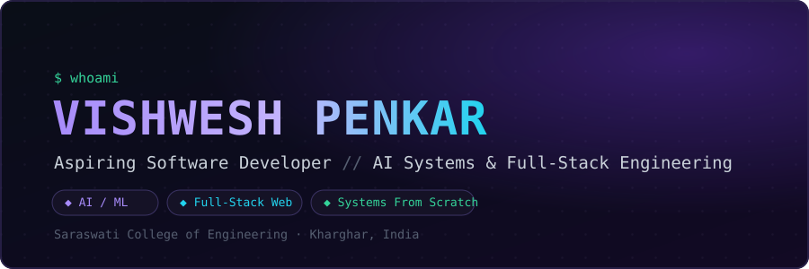
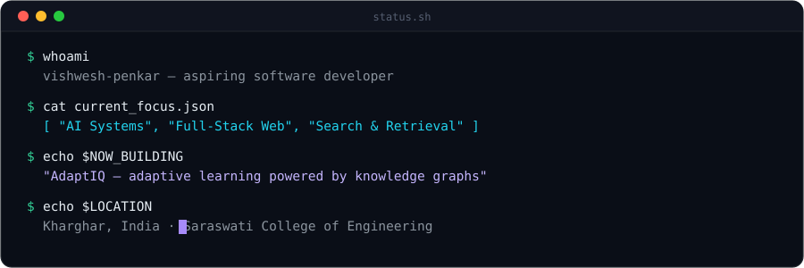
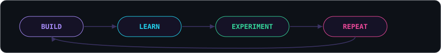
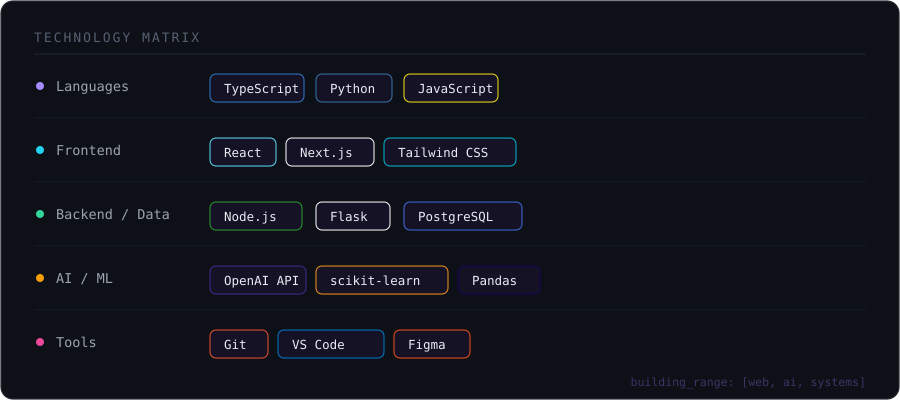
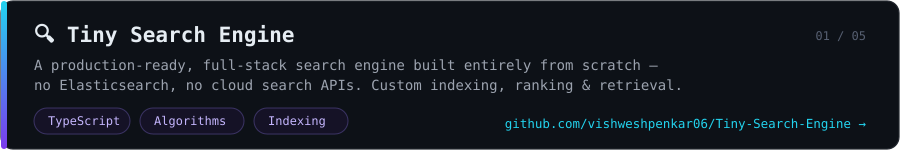
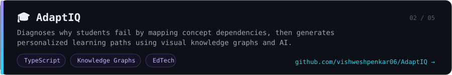
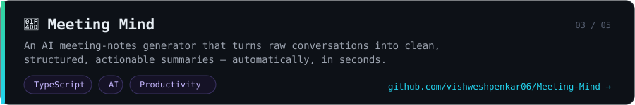
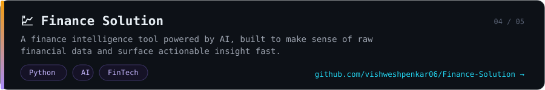
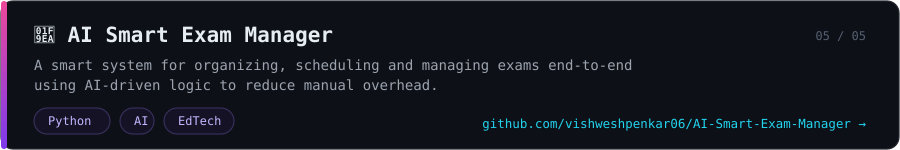

  

  

  

 

---

### 📡 SYSTEM STATUS

  

 

---

### ⚙️ TECHNOLOGY MATRIX

 

---

### 🚀 FLAGSHIP SYSTEMS

  

  

  

  

 

---

### 🐍 ACTIVE CONTRIBUTION MATRIX

  

 

---

### 📊 ANALYTICS TELEMETRY

  

  

 

---

### 📡 ESTABLISH CONNECTION

  

